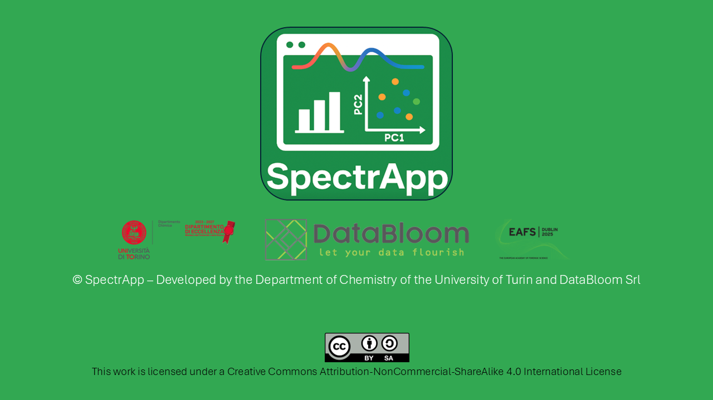

<h1 align="center">

    <strong>Leveraging Machine Learning with SpectrApp:  An Open-Source Solution for Forensic Data Analysis</strong>
</h1>

### *Discover SpectrApp - an innovative open-source tool developed by the Department of Chemistry of the University of Turin and DataBloom Srl*

## Introduction

SpectrApp combines advanced machine learning capabilities with an intuitive, user-friendly interface, making it the ideal solution for both professionals and those new to the field. Whether you're conducting complex data analysis or exploring machine learning for the first time, SpectrApp empowers users at every skill level to work efficiently and with confidence.

Attendees will learn to apply multivariate data analysis and chemometric strategies. The workshop will cover diverse visualization methods, including univariate, bivariate, and multivariate plots, to help identify complex patterns in data. Participants will gain hands-on experience with cluster analysis, Principal Component Analysis (PCA), and advanced methodologies like PLS-Discriminant Analysis (PLS-DA) and PLS-Regression (PLS-R). They will also learn how SpectrApp facilitates the prediction of new samples, enhancing forensic investigations.

---

## Table of contents
- [Link](#link)

- [Examples](#examples)

- [License](#license)

- [Credits](#credits)

---

## Link

To access SpectrApp, retrieve your personal link from the [Excel spreadsheet](./SpectrApp_links.xlsx)

<kbd><a href="#table-of-contents">↑ Back to top ↑</a></kbd>

---

## Examples

Partecipants will have access to a wide collection of [datasets](./datasets/) that can be used throughout the workshop to test and explore the capabilities of SpectrApp. These datasets cover a wide array of application areas, from specialized forensic contexts to broader, more general domains, providing a comprehensive foundation for hands-on experimentation and analysis.

### Workshop datasets

1. [Bloodstains](./datasets/eafs2025_blood.csv)
    - **Features**: 600 NIR wavelenghts;
    - **Classes**: 3 subjects, 2 instruments;
    - **Samples**: 30 samples;
    - **DOI**: [10.1016/j.talanta.2019.120565](https://doi.org/10.1016/j.talanta.2019.120565) 
2. [Carpaints](./datasets/eafs2025_carpaints.xlsx)
    - **Features**: 175 NIR wavelenghts;
    - **Classes**: 2 classes, 4 replicates;
    - **Samples**: 48 samples;
3. [Spraypaints](./datasets/eafs2025_spraypaints.xlsx)
    - **Features**: UV-Vis. FTIR and micro-Raman wavelenghts;
    - **Classes**: Spray brands, fluo vs. non-fluo;
    - **Samples**: ~30 samples;
4. [Gunshot residue](./datasets/eafs2025_gsr.xlsx)
    - **Features**: SEM/EDX elemental analysis concentrations;
    - **Classes**: Stubs and data from hands, barrell, cartridge and hammer;
    - **Samples**: ~80 samples;
5. [Glass](./datasets/eafs2025_glass.csv)
    - **Features**: μ-XRF elements composition from glass samples and refraction index;
    - **Classes**: 3 classes (lightbulb, windows, and cars);
    - **Samples**: 105 samples;
6. [Gasoline](./datasets/eafs2025_gasoline.csv)
    - **Features**: NIR wavelenghts between 900 and 1700 nm;
    - **Response**: Octane number rating;
    - **Samples**: 60 samples;
7. [Wines](./datasets/eafs2025_wines.csv)
    - **Features**: set of covariates;
    - **Classes**: 3 Italian wines (Barolo, Barbera, and Grignolino);
    - **Samples**: 178 samples;
    - **DOI**: [10.5073/vitis.1986.25.189-201]( https://doi.org/10.5073/vitis.1986.25.189-201)  

<kbd><a href="#table-of-contents">↑ Back to top ↑</a></kbd>

---

## License

SpectrApp is available under the **[Creative Commons Attribution-NonCommercial-ShareAlike 4.0 International License](./docs/LICENSE.txt)**.

<kbd><a href="#table-of-contents">↑ Back to top ↑</a></kbd>

---

## Credits

SpectrApp was developed by a team of contributors, including:
- [Eugenio Alladio](https://www.chimica.unito.it/do/docenti.pl/Show?_id=ealladio#tab-profilo), Assistant Professor at University of Turin, Department of Chemistry
- [Alberto Mazzoleni](https://dott-scm.campusnet.unito.it/do/studenti.pl/Show?_id=954292#profilo), PhD Student at University of Turin, Department of Chemistry
- [Giovanni Solarino](https://dott-scm.campusnet.unito.it/do/studenti.pl/Show?_id=982868#profilo), PhD Student at University of Turin, Department of Chemistry
- [Lorenzo Castellino](https://dott-scm.campusnet.unito.it/do/studenti.pl/Show?_id=826363#profilo), PhD Student at University of Turin, Department of Chemistry

 

The application has been developed using [R](https://www.r-project.org/) and [ShinyR](https://shiny.posit.co/), an interactive framework for web applications in R.

The app was developed with the assistance of [DataBloom](https://www.databloom.it/) an academic, innovative start-up of the Department of Chemistry of the University of Turin.

<kbd><a href="#table-of-contents">↑ Back to top ↑</a></kbd>

---

**Follow us** at 

---