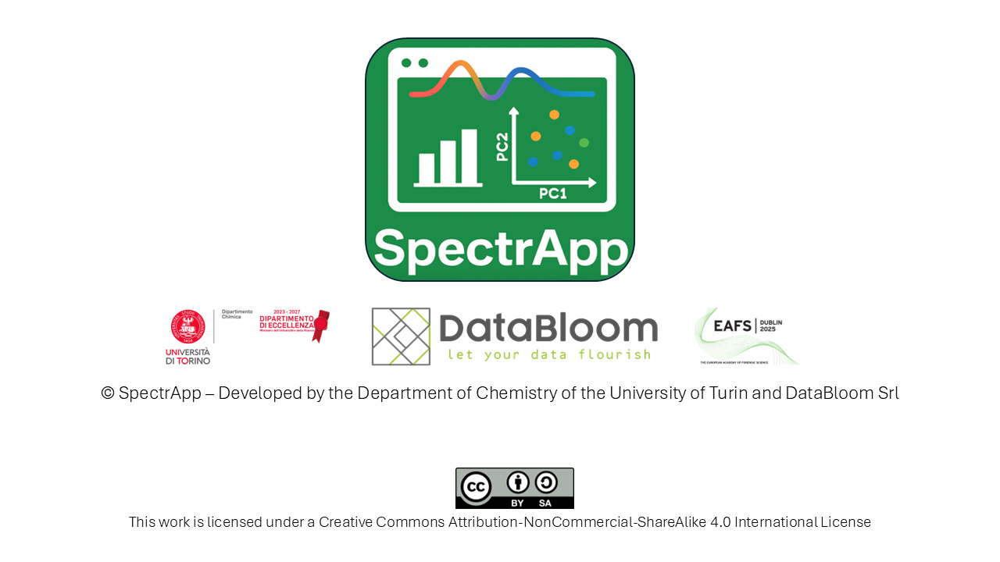

<h1 align="center">

    <strong>Leveraging Machine Learning with SpectrApp:  An Open-Source Solution for Forensic Data Analysis</strong>
</h1>

### *Discover SpectrApp - an innovative open-source tool developed by the Department of Chemistry of the University of Turin and DataBloom Srl*

## Introduction

SpectrApp combines advanced machine learning capabilities with an intuitive, user-friendly interface, making it the ideal solution for both professionals and those new to the field. Whether you're conducting complex data analysis or exploring machine learning for the first time, SpectrApp empowers users at every skill level to work efficiently and with confidence.

Attendees will learn to apply multivariate data analysis and chemometric strategies. The workshop will cover diverse visualization methods, including univariate, bivariate, and multivariate plots, to help identify complex patterns in data. Participants will gain hands-on experience with cluster analysis, Principal Component Analysis (PCA), and advanced methodologies like PLS-Discriminant Analysis (PLS-DA) and PLS-Regression (PLS-R). They will also learn how SpectrApp facilitates the prediction of new samples, enhancing forensic investigations.

---

## Table of contents
- [Installation](#installation)

- [Examples](#examples)

- [License](#license)

- [Credits](#credits)

---

## Installation

[PLACEHOLDER FOR INSTALLATION INSTRUCTIONS]

<kbd><a href="#table-of-contents">↑ Back to top ↑</a></kbd>

---

## Examples

[PLACEHOLDER FOR DATASETS LINK AND BRIEF DESCRIPTION]

<kbd><a href="#table-of-contents">↑ Back to top ↑</a></kbd>

---

## License

SpectrApp is available under the **[Creative Commons Attribution-NonCommercial-ShareAlike 4.0 International License](./docs/LICENSE.txt)**.

<kbd><a href="#table-of-contents">↑ Back to top ↑</a></kbd>

---

## Credits

[PLACEHOLDER FOR CREDITS]

<kbd><a href="#table-of-contents">↑ Back to top ↑</a></kbd>

---

**Follow us** at 

---